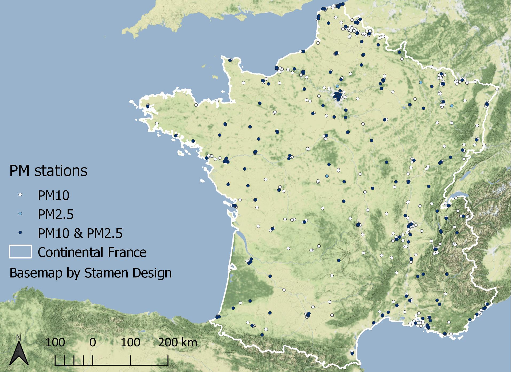
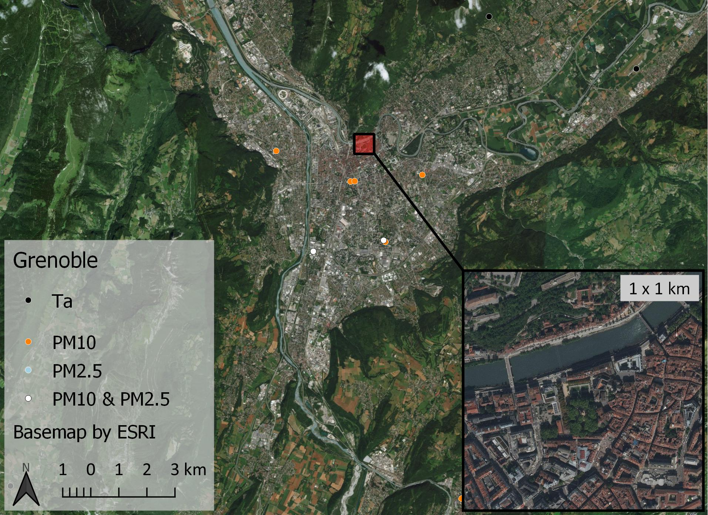
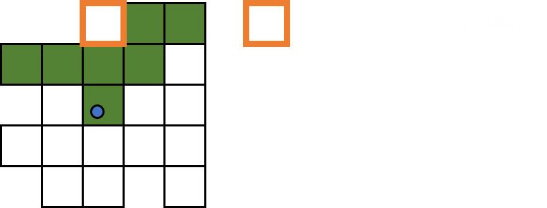

---
output:
  revealjs::revealjs_presentation:
    css: research_proposal.css
    self_contained: false
    theme: black
    transition: fade
    reveal_options:
      slideNumber: true
bibliography: references.bib
csl: remote-sensing-of-environment.csl
---

## Climate change, air pollution, and perinatal health: the combined effects of temperature and air pollution in sensitive populations {data-background="#ffffff"}

### PhD Research Proposal

Ian Hough

2018-10-16

Advisors Itai Kloog & Johanna Lepeule

  

## Outline

1. Context
    1. Overview
    1. Adverse birth outcomes
    1. Ambient temperature & particulate matter
1. Proposed research
    1. Objectives
    1. Exposure models
    1. Birth outcomes study

## Context {.center}

## Overview

## Adverse birth outcomes

### Preterm birth (<37 weeks gestation)

* Leading cause of child mortality [@Liu2016]
* 11% of all births and increasing [@Harrison2016]
* Sequalae in childhood and adulthood (e.g. asthma, cerebral palsy, behavioural problems) [@McCormick2011]

### Term low birth weight (<2500 g)

* Increased morbidity and mortality in childhood and adulthood [@Barker2004; @Belbasis2016]

## Ambient temperature (T~a~)

* Heat, cold, or variable T~a~ can increase risk [@Zhang2017]
* Response may depend on local population & climate
* Hard to synthesize findings

#####

|           | Preterm birth       | Birth weight         | Term low birth weight |
|-----------|---------------------|----------------------|-----------------------|
| Exposure  | Cold (<10th %ile)   | IQR Ta increase      | Heat (>95th %ile)     |
| Window    | Weeks 1–7           | Last 30 days         | Trimester 3           |
| Statistic | Relative risk       | Decrease             | Odds ratio            |
| Effect    | 1.09 [1.04–1.15]^a^ | 16.6 g [5.9–27.4]^b^ | 1.31 [1.15–1.49]^c^   |
| Study     | [@Ha2017a]          | [@Kloog2015]         | [@Ha2017b]            |

## Particulate matter (PM)

#### PM~10~ &uarr; 10 $\mu$g/m^3^ entire pregnancy

|           | Preterm birth     | Birth weight       | Term low birth weight |
|-----------|-------------------|--------------------|-----------------------|
| Statistic | Pooled odds ratio | Pooled decrease    | Too few studies       |
| Effect    | 0.97 [0.86--1.08] | 10.3 g [7.1--13.6] |                       |
| Study     | [@Lamichhane2015] | [@Lamichhane2015]  |                       |

#### PM~2.5~ &uarr; 10 $\mu$g/m^3^ entire pregnancy

|           | Preterm birth     | Birth weight       | Term low birth weight |
|-----------|-------------------|--------------------|-----------------------|
| Statistic | Pooled odds ratio | Pooled decrease    | Pooled odds ratio     |
| Effect    | 1.13 [1.03--1.24] | 15.9 g [5.0--26.8] | 1.09 [1.03--1.15]     |
| Study     | [@Sun2015]        | [@Sun2016]         | [@Sun2016]            |

## Proposed research {.center}

## Objectives

1. Model daily min, mean, and max T~a~ in France 2000--2016
    * 1 km estimates entire area
    * 200 m estimates for urban areas
2. Model daily PM~10~ and PM~2.5~ in France
    * 1 km estimates entire area
    * 200 m estimates for urban areas
3. Study associations between T~a~, PM, and birth outcomes
    * Windows of susceptibility
    * Acclimatization to T~a~
    * Interactions between T~a~ and PM

## Exposure models {.center}

## Why model T~a~ and PM?

Sparse monitoring networks

&rarr; Error in exposure estimate

&nbsp;&nbsp;&nbsp;&nbsp;&rarr; May bias effect estimates towards null

---

---

## Modelling approaches

### Physical models

* Numerical weather prediction &rarr; complex
* Dispersion / chemical transport &rarr; complex

### Statistical models

* Inverse distance weighting &rarr; poor performance
* Land use regression &rarr; low temporal variability
* ***Hybrid models***

## Hybrid statistical models

### 1. Satellite data (& other spatial predictors)

* T~a~ &larr; land surface temperature (LST)
* PM &larr; aerosol optical depth (AOD)

### MODIS (Terra + Aqua)

* 1 km spatial resolution
* LST 2x / day + 2x / night
* AOD 2x / day
* Free ready-to-use products (LST and AOD)

## Hybrid statistical models

### 2. Statistical model

* Linear regression
* Geographically weighted regression
* Spatiotemporal regression-kriging
* *Linear mixed models* [@Kloog2014; @Kloog2017; @Just2015; @Shtein2018]
* Random forest, gradient boosting, elastic net, etc.

## Linear mixed model approach

## Stage 1: calibration

$T_a = (\alpha + \mu_{jr}) + (\beta_1 + \nu_{jr}) \cdot LST + \beta_2 \cdot Emissivity + \\
\; \; \; \; \; \; \; \; \beta_3 \cdot NDVI + \beta_4 \cdot Elevation + \beta_5 \cdot Population + \\
\; \; \; \; \; \; \; \; \beta_6 \cdot Land Cover + e$

*j* = day

*r* = climatic region

## Stage 2: prediction

## Stage 3: gap filling

$T_{a\ predicted} = (\alpha + \mu_{ip}) + (\beta_1 + \nu_{ip}) \cdot T_{IDW} + e$

*i* = grid cell

*p* = two-month period

---

## Model performance

### Cross-validated 1 km predictions

| 2000--2016  | R^2^ | RMSE | Spatial R^2^ | Temporal R^2^ | Spatial RMSE |
|-------------|------|------|--------------|---------------|--------------|
| T~a~ min    | 0.92 | 1.89 |         0.83 |          0.93 |         0.97 |
| T~a~ mean   | 0.97 | 1.29 |         0.95 |          0.97 |         0.57 |
| T~a~ max    | 0.95 | 1.81 |         0.89 |          0.96 |         0.99 |

### Improvement over previous model [@Kloog2017]

| 2000--2011 | R^2^ | RMSE | Spatial R^2^ | Temporal R^2^ | Spatial RMSE |
|------------|------|------|--------------|---------------|--------------|
| T~a~ mean  | 0.02 | 0.25 |         0.04 |          0.01 |         0.09 |

---

## Urban 200 m predictions

### Landsat 5 / 7 / 8 (ETM+ / TIRS)

* 60 m / 120 m spatial resolution
* One overpass every 16 days (sometimes 8 days)
* No precalculated LST (at-satellite brightness temperature)

### Building footprints + height

* Skyview factor

## Stage 4: urban calibration

$Residual = (\alpha + \mu_{jr}) + (\beta_1 + \nu_{jr}) \cdot BT \; + \; ... \; + e$

*j* = day

*r* = climatic region

## Stage 5: urban gap filling

$Residual_{predicted} = (\alpha + \mu_{ip}) + (\beta_1 + \nu_{ip}) \cdot T_{IDW} + e$

*i* = grid cell

*p* = period

## T~a~ model status

### Complete

* T~a~ 1 km estimates

### In progress

* T~a~ 200 m urban estimates
* T~a~ paper

## PM model status

### In progress

* PM data preparation

### Forthcoming

* PM 1 km estimates
    * Estimate PM~2.5~ at PM~10~-only stations
    * Reduce MAIAC error using AERONET data [@Just2018]
* PM 200 m urban estimates
* PM paper

## Birth outcomes study {.center}

## Unresolved questions

### Windows of susceptibility

* Mixed results to date
* PM exposure tends to be correlated across trimesters

### Acclimatization

* Suggested for mortality [@Gasparrini2015; @Lee2014]

### Interactions between T~a~ and PM

* Synergy suggested for mortality [@Kioumourtzoglou2016; @Li2017]

## Study design

* 5923 mother-child pairs from three prospective cohorts
* Birth weight, term low birth weight, preterm birth
* High, low, and variable T~a~ and PM
* Windows of susceptibility
    * Day, up to 7 days, week, 4 weeks, trimester, entire pregnancy
* Acclimatization
* Interactions
* Linear / logistic / Cox models
    * Distributed non-linear lags

## Thank you! {.center}

## References {.refslide}

